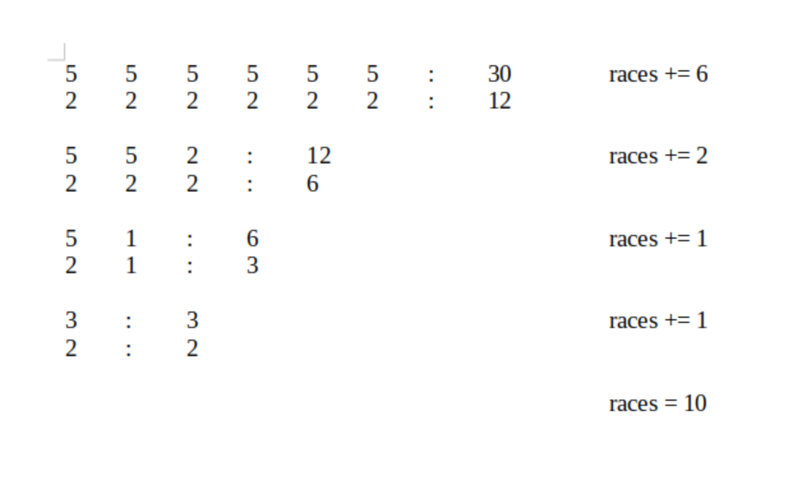
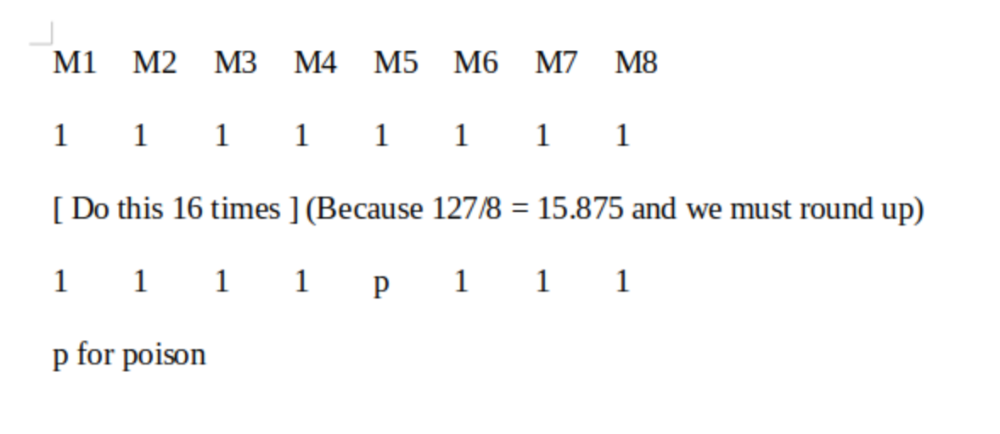
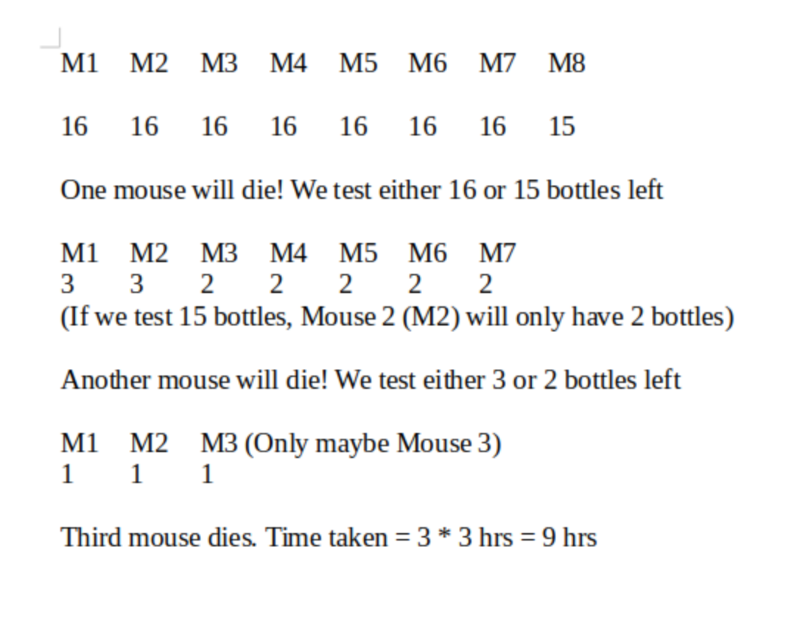

# predf

**There are 30 horses. What is the minimum number of races needed so you can identify the fastest 2 horses? You can race up to 5 horses at a time, but you do not have a watch. Please write your answer in detailed steps.**

**For the horses problem:**
In every race we take the fastest two horses

`go run horse.go`

**There are 127 bottles of water, one of which is poisoned. It takes 3 hours for the poison to take effect. You are given 8 mice. How long will it take to test which bottle of water is poisoned? Please write your answer in detailed steps.**

for the poison bottle problem:
It actually depends. Depends how precious a mouse's life is to you.

**If very precious:**

We basically let each mouse test a sip from one different bottle each

Then we wait 3 hours to see if any mouse has a reaction

We repeat this until a mouse shows a reaction to the poison then that bottle is the poisonous one

This will not take more than ((127/8) + 1) * 3 hrs = 16(Because it was a floor division) * 3 hrs = 48 hrs

This could take shortest just 3 hrs because the first round of tests may show the poison

At most one mouse will be hurt.

**If not precious:**

We divide the bottles into almost equal groups (16 * 7) + 15

Each mouse takes a sip from each bottle in a group that is assigned to it

We repeat the step minus the poisoned mouse until we find the poisoned bottle

We use the bottles of the poisoned mouse's group to repeat the step

For each round one mouse will be poisoned

The bottle which the last poisoned mouse sipped from is the poisoned bottle

It will take exactly 9 hrs.

**The company organizes an annual dinner with a total of 801 people. Each person has a
number plate, and each person's number plate is different. Originally, everyone can add
the number plate of another person’s to get a score of 888, but because the total number
of people in the company is odd, there must be someone who did not get a number plate.
Please work out a formula find this single person, and analyze the time taken and tediosity
of the formula.**

Let's say that each of these number plates are an integer in an array of integers

We want to find the index of the number plate without a complementing pair

`go run dinner.go`

The solution's time will be O(n) and the memory usage will also be O(n)

**There is a train from Shenzhen to Beijing without stopping. There are a total of 10 million
seats on this train. When the seat number is 1-10 million, the conductor sells two tickets
with the same seat number. It is assumed that the tickets sold by the conductor are
recorded and stacked randomly. How to quickly find out the number of a heavily sold ticket.
Please work out a formula and analyze the time taken and tediosity of the formula.**

This question is a little unclear so this may not be the intended solution

Assuming we're to find the most popular seat number that is purchased

Let's say everytime a seat is sold, the seat number is entered twice into an integer array

Let's say passengers get to pick their seat

The train goes back and forth many times and we want to find the favourite seat of passengers

`go run seat.go`

The solution's time will be O(n) and the memory usage will also be O(n)

**How many types of Go channels are there and what is the difference between them?**

I referred [here](https://www.golangprograms.com/go-language/channels.html) to find out

Basically channels are for sending data between goroutines and goroutines are for concurrent activity which Go is known for

Data is sent into a channel like so: `channel <- data` and the channel sends the data like so: `data := <- channel`

There are two types of Go channels **Buffered** and **Unbuffered**:

**Buffered channels**:

For sending data asynchronously

A buffered channel is declared like so `buffered := make(chan int, 10)`

The int means that this is a channel for passing integers and the 10 means the number of values it will buffer

When data is received from a buffered channel the channel will hold the data of its capacity until the receiving point receives the data

If there is no available buffer to place the data being sent the **send** will block

If there is no data being sent, a **receive** will block

**Unbuffered channels**:

For sending data synchronously

An unbuffered channel is declared like so `unbuffered := make(chan int)`

The int meaning it sends and receives integers but unlike a buffered channel it has no capacity declaration

> An unbuffered channel provides a guarantee that an exchange between two goroutines is performed at the instant the send and receive take place. A buffered channel has no such guarantee.

An unbuffered channel will make a **send** or **receive** goroutine wait if the **send** and **receive** are not ready at the same instant
